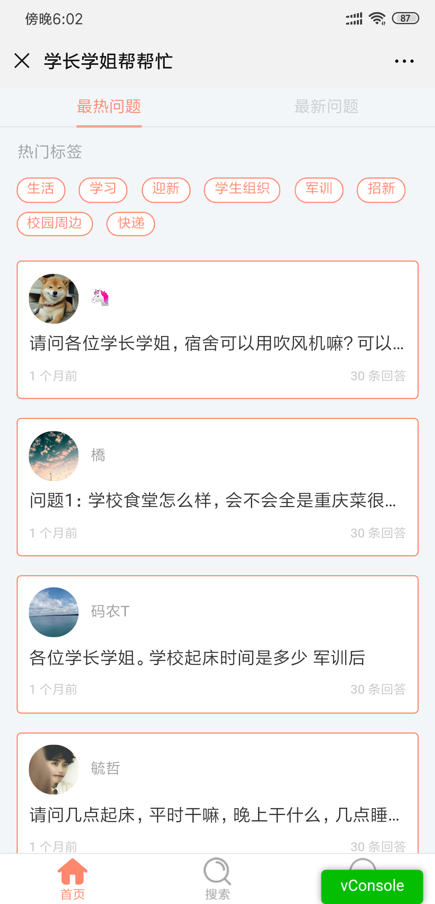
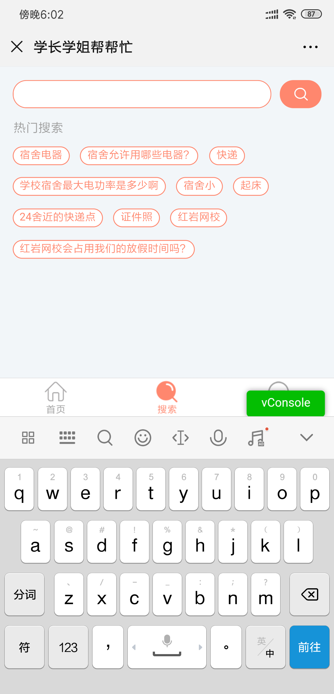
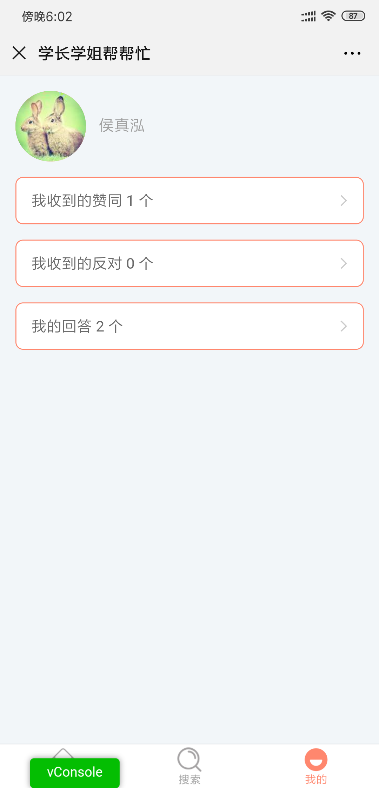
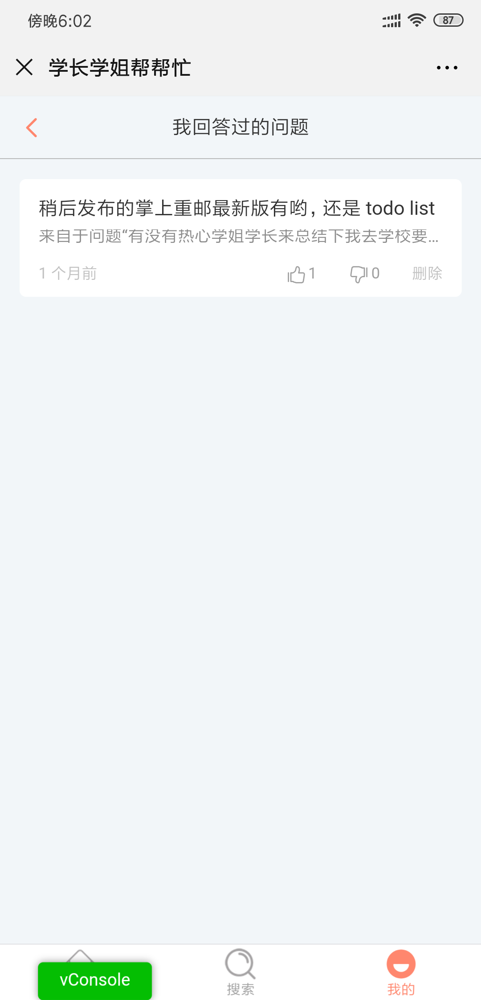
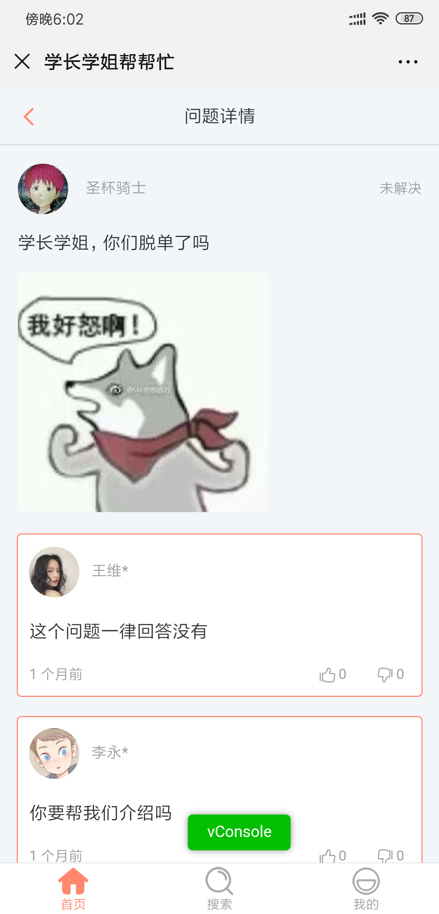
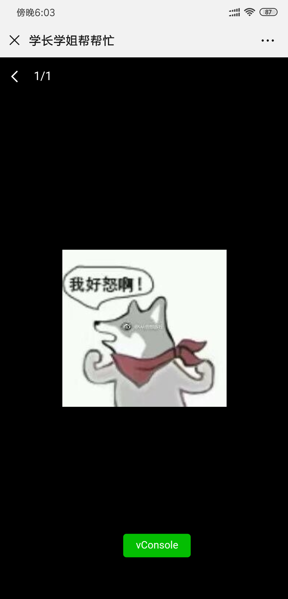
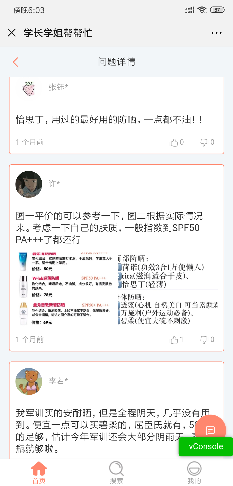

### 整体结构

为了方便只展示 src 目录下的文件

```
│  App.vue 
│  globalsComponents.js // 让 V****.vue 的组件自动注册的全局
│  main.js
│  registerServiceWorker.js
│
├─assets
│  ├─styles
│  │      base.less // less 的一些全局的变量
│  │      button.less // 公共的 button
│  │      global.less // 全局样式
│  │      profile.less // 个人界面样式
│  │      reset.css //  Eric Meyer's Reset CSS
│  │
│  └─svg // 本项目全部的图标都使用 svg
│          *.svg
│
├─common
│  │  throttle.js // 查看下一页帮助节流 
│  ├─config
│  │      index.js // 定义后端 api 入口
│  ├─filter // vue 的模板中使用的 filter
│  │      date.js // 使用 timeago.js 来格式化时间，以及解决 ios 的问题
│  │      https.js // http to https
│  │      name.js // 隐藏最后一个域名
│  │
│  └─service
│          api.js // 定义全部的请求函数
│          jwt.js // 处理 jwt 逻辑
│
├─components
│      Answer.vue // 问题详情页面的回答
│      AnswerAction.vue // 回答卡片的一些操作
│      EditAnswerBox.vue // 回答编辑
│      EditBox.vue // 问题编辑
│      EditImage.vue // 公共的图片编辑
│      EditTag.vue // 公共的选择 tag
│      HomeEditButton.vue // 首页中编辑按钮
│      HomeHeader.vue // 首页上面选择最新 / 最热
│      HomeHotTag.vue // 最新标签
│      ProfileAnswer.vue // 用户的回答
│      ProfileNew.vue // 新生用户
│      ProfileOld.vue // 老生用户
│      ProfileQuestion.vue // 用户的问题
│      QuestionReplyButton.vue // 问题详情页面的回答按钮
│      SearchBox.vue // 搜索框
│      SearchHot.vue // 热门搜索
│      TheFooterNavBar.vue // 底部导航
│      VBack.vue // 公共放回
│      VCarousel.vue // 画廊
│      VHeader.vue // 公共的头部
│      VHotTag.vue // 热门标签
│      VHotTagForSearch.vue // 热门标签（搜索）
│      VImage.vue // 公共图片
│      VImageForAnswer.vue // 公共图片 （回答）
│      VLoading.vue // 公共加载
│      VMask.vue // 弹窗蒙版
│      VPopup.vue // 弹窗
│      VPublishButton.vue // 发布按钮
│      VQuestion.vue // 问题卡片
│      VQuestionForHome.vue // 首页使用的问题卡片
│      VToast.vue // 提示框
│
├─mixin
│      fectchMore.js // 加载更多
│
├─router
│      index.js // 路由注册
│
├─store // vuex
│  │  edit.js // 编辑有关
│  │  index.js
│  │  loading.js // 加载
│  │  profileIdentify.js // 用户相关
│  │  question.js // 问题
│  │  questionList.js // 问题列表
│  │  searchHot.js // 热门搜索
│  │  tagHot.js // 热门标签
│  │
│  └─type // 常量
│          actions.js
│          mutations.js
│
└─views // 页面
        AnswerEdit.vue // 回答编辑
        Home.vue // 首页
        HomeHot.vue // 热门
        HomeNew.vue // 最新
        HomeTag.vue // 分类
        Profile.vue // 个人
        ProfileAnswer.vue // 个人回答
        ProfileQuestion.vue // 个人问题
        Question.vue // 问题详情页面
        QuestionEdit.vue // 问题编辑
        Search.vue // 搜索页面

```

## 技术栈

- vue 
- vuex
- vue-router
- axios


## 项目运行

使用 [Vue CLI](https://cli.vuejs.org/) 创建，按照标准即可完成

整体结构参考 [vue-realworld-example-app](https://github.com/gothinkster/vue-realworld-example-app)

.env

```shell
VUE_APP_API='*' // 后端地址
VUE_APP_GA='UA-**' // 谷歌统计
VUE_APP_DSN='https://**' // sentry.io 报错平台
```


## 注意点

1. 一像素边框

   使用 postcss-retina 将边框自动变成 `transform: scale(x);` 方式让其在所有屏幕上表现一致

2. px to vw

   使用 postcss-px-to-viewport 将 px 转换成  vw

3. 微信缓存

   在某些 iOS 版本的微信浏览器中如果 uri 相同，那么浏览器将不会进行新的请求，所以在从后端拿到 token 之后应该将 uri 变化一下

4. 时间

   iOS 上面的 date 对象创建的使用分割符使用的是 `/` 而不是 `-` 需要进行判断并作如下修改

   ```js
   new Date((date).replace(/-/g, '/')).getTime();
   ```

5. 图片的获取

   img.onload 中的 event 对象中 iOS 没有 e.path[0]，可以通过 `new Image();` 返回的对象来取得

6. 图片倒转

   需要将 EXIF 中的信息读出并通过 canvas 进行翻转

 

## 特别的一些地方

- 底部导航栏的状态更新

  watch this.$route 来监控更新

  ```js
  watch: {
      $route (to) {
        this.isHome = to.name.match(/home/g) || to.name.match(/question/g) ? true : false
        this.isSearch = to.name === 'search' ? true : false
        this.isProfile = to.name.match(/profile/g) ? true : false
      }
    }
  ```

  


## 更新日志

  本项目遵从 [Angular Style Commit Message Conventions](https://gist.github.com/stephenparish/9941e89d80e2bc58a153)，更新日志由 `standard-changelog` 自动生成。完整日志请点击 [CHANGELOG.md](./CHANGELOG.md)

## 图例













